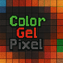
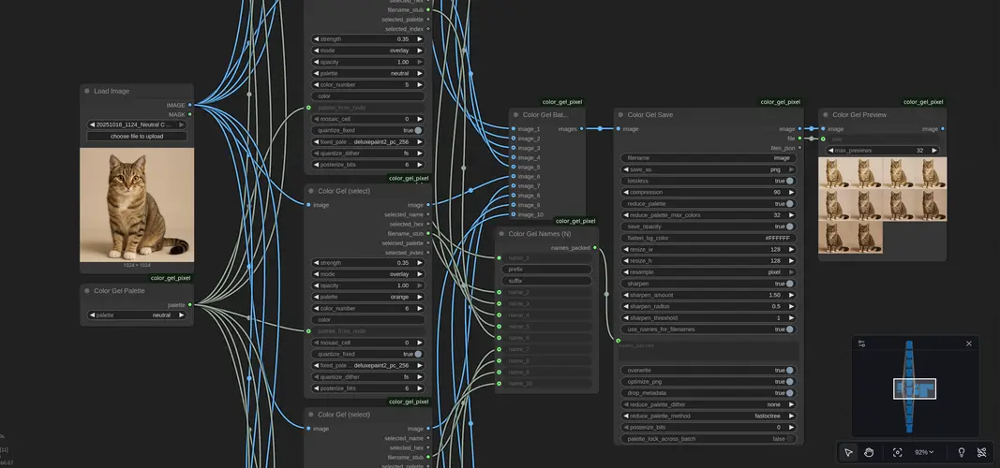

SPDX-License-Identifier: MIT

# Color Gel Pixel

Minimal, typed ComfyUI nodes to apply color gels from JSON palettes.
Package (registry/manager) name: `Color_Gel_Pixel`

Preview
- 

Changelog
- See `CHANGELOG.md` for release notes.

Example workflow
- See `docs/workflow_color_gel_pixel.json` for a ready-to-run example wiring:
  - Load two images → Color Gel (select) per image → Color Gel Batch (N) → Color Gel Save → Color Gel Preview
  - Color Gel Names (N) packs names to save files directly from node outputs
  - Uses the new generic palettes (e.g., `neutral`, `blue`, ...)

Highlights:
- Preloaded palettes (no I/O during node execution)
- Streamlined nodes: "Color Gel (select)", "Color Gel Save", "Color Gel Preview"
- Batch support: combine up to 10 images via "Color Gel Batch (N)" and name files with "Color Gel Names (N)"
- Utilities: central palette switch via "Color Gel Palette"; batch concat via "Color Gel Batch Flatten".

Usage:
- Place this folder under `ComfyUI/custom_nodes/`.
- In your graph, use:
  - `Color Gel (select)`: choose `palette` and `color_number` (1-based). Optional `opacity` [0..1] to add/scale alpha for transparency.
  - `Color Gel Palette`: pick a palette once and wire its `palette` → `Color Gel (select).palette_from_node` for global switching.
  - `Color Gel Save`: save to PNG/WebP with options: resize, opacity flatten, background color, palette reduction, quality/compression.
  - `Color Gel Preview`: connect any IMAGE to show a dedicated preview window (OUTPUT node).

Menu categories:
- Nodes appear under `Color Gel Pixel/Core`, `Color Gel Pixel/Batch`, and `Color Gel Pixel/Utils`.

Detailed docs for every node and option: see docs/USAGE.md

Palettes:
- JSON files under `comfy_plugin/palettes/` (name becomes palette id)
- Supports `{ "Name": "#RRGGBB", ... }` or list of objects with `name` + `hex`/`rgb`.

License: MIT
